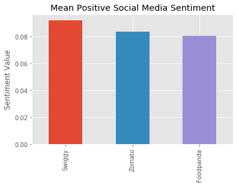
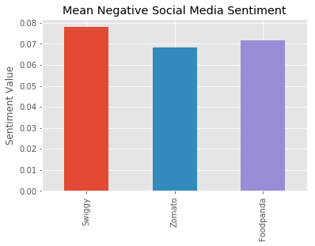
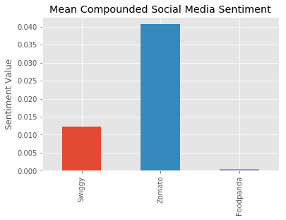
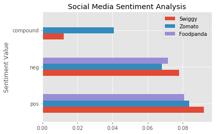
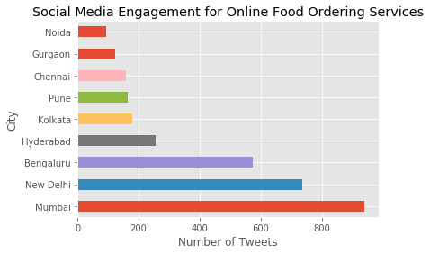

# Twitter-data-analysis

The data available on Twitter is an extremely valuable resource to gather information about the interaction of any company with it's customers. People often post about their experiences with various products and services that they use with the online community. Lately, this has been especially prevelant on Twitter. 
This makes data collected from Twitter a great place to do market analysis, comparing a buisness with it's competitors and gathering the demographic and information about the users of the service that can be extremely useful in making various buisness decisions. 

One of the segments for which this data can prove to be immensely useful is online food ordering services. These services often cater to their customer greivances through their Twitter handle, which means that they generate a huge amount of data about their customer interactions, service problem areas as well as how they fare against their competitors. 

Through this project, I will demonstrate the methodology of analysing twitter data right from mining the data via python to creating visualizations that will help decision makers in understanding their business.

The following segment provides a general introduction, read the full paper here: [Sentiment Analysis of Twitter Data using Python](1538566070742_Paper.pdf)

This project is divided into the following segments:

1. Data Scrapping and Mining using Python

There are several libraries that are available in Python to mine data. The most prominent and extensive of them being Tweepy. We chose Tweepy amongst the alternatives because of it's excellent and huge developer and user community. It is regularly maintained in accordance to the new versions of Python. 
Tweepy provides support for both the REST API for Standard Search in Twitter and real-time data streaming from Twitter. 

>There are certain limitations to the Standard Search such as:
>1. It can only retrieve data via a keyword search for the last 7 days
>2. The data retrived is not the full set of available tweets for the keyword but only the top searches

Due to these limitations we decided to Stream data in real-time for 9 days inorder to get a more richer and accurate data set for our analysis. 

2. Understanding the attributes of Twitter data 

In the data set I extracted from Twitter I was able to gather a total of 10,108 tweets that were about online food ordering services. From these, I segmented the Data further into the particular online food ordering service that it was concerned with like Swiggy, FoodPanda and Zomato. 
There was huge amounts of data that was available for the users that made these tweets. Including mentions, hastags used, retweet status, location of the user etc. Since, significant amount of data was available for the tagged location of the user from where the tweet was made, we used it to analyse which cities engage the most with online food ordering services on social media. 

The main chunk of the data was text data that I used to perform sentiment analysis.

3. Arranging Data and Extracting useful information 

To perform the analysis and generate graphs I first mapped all the data into pandas DataFrames. DataFrames have great support for matplotlib and make it very easy to plot the data. 

To perform the sentiment analysis I used the Vader Lexicon. 

4. Data Analysis and graphical representations.

